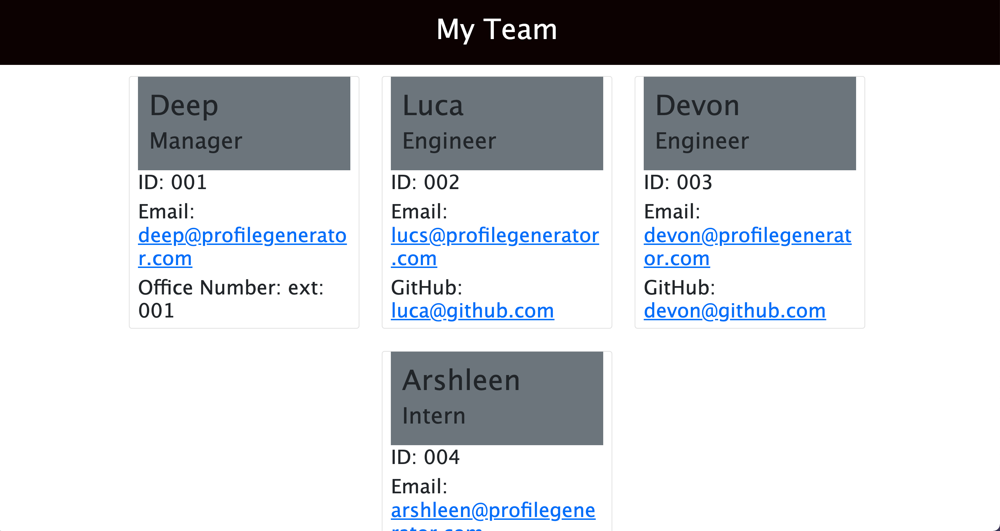

# 09 Professional README Generator

## Project Description

When creating an open source project on GitHub, it’s important to have a high-quality README for the application. This should include what the app is for, how to use the app, how to install it, how to report issues, and how to make contributions&mdash;this last part increases the likelihood that other developers will contribute to the success of the project. 

This application can quickly and easily create a README file by using a command-line application to generate one. This allows the project creator to devote more time to working on the project.

This command-line application dynamically generates a professional README.md file from a user's input using the [Inquirer package](https://www.npmjs.com/package/inquirer).

The application will be invoked by using the following command:

```bash
node index.js
```

## Screenshot

The following image shows the Good ReadMe Generator application's appearance and functionality:




You can view the walkthrough video at: <https://drive.google.com/file/d/13hAt4AlIbY4oPaa05g3cc0ntjxblyEB_/view?usp=sharing>

The URL of the GitHub repository is: <https://github.com/ArshleenKNagpal/good-readme-generator>


---

© 2021 Trilogy Education Services, LLC, a 2U, Inc. brand. Confidential and Proprietary. All Rights Reserved.
